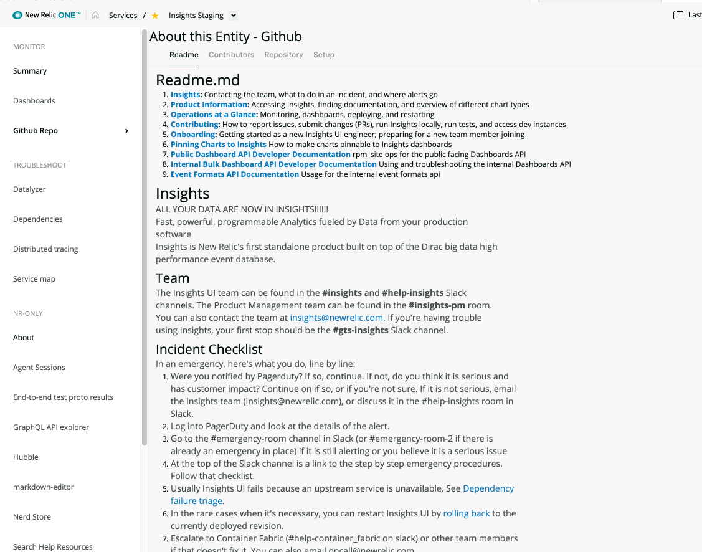
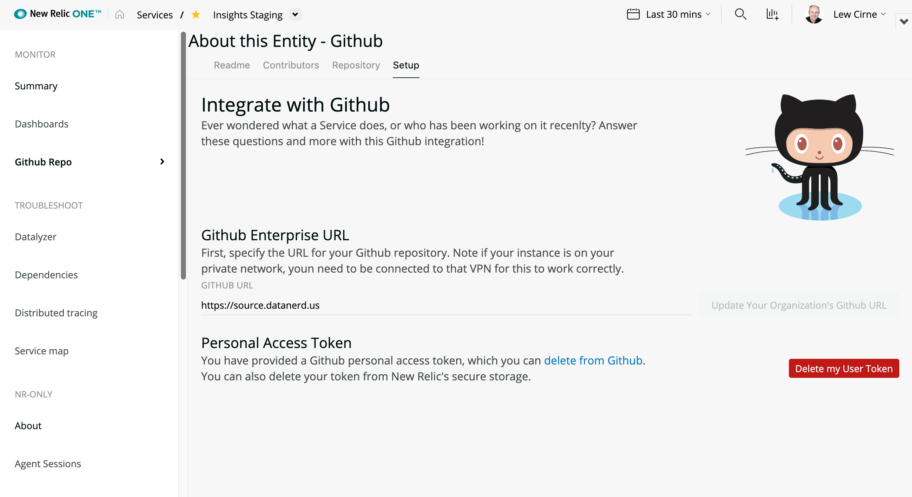

# nr1-github-nerdpack
Integrate New Relic One with Github (either public or private enterprise instance)
to bring more context to your entities.

Associate any service or application with its github repository as a one-time action
and then you can quickly see that applcition's README file, as well as a list
of most active source code contributors

## Using Github Access Tokens
Integration with github requires the user to create or use a private
access token as a one-time setup step. New Relic will securerly store
that access token, but the user can easily delete it from New Relic's storage
at any time.

## TODO
- Clearly document how the license key stuff works/is secured, and 
recommnended permissions for the license key
- Error Handling:
  - Bad URL for Github instance
  - Can't connect to Github instance (usually a VPN issue)
- Styling

## ScreenShots

