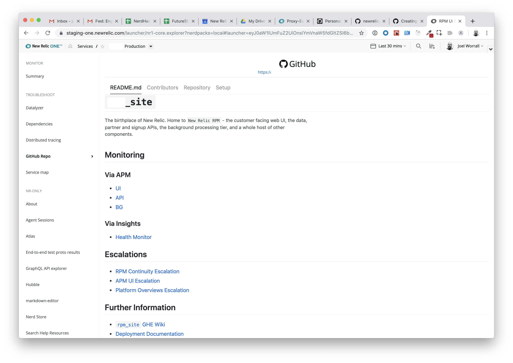

[](https://opensource.newrelic.com/oss-category/#new-relic-one-catalog-project)

# New Relic One GitHub Integration (nr1-github)

  [](https://snyk.io/test/github/newrelic/nr1-github)

## Usage

GitHub Integration connects services and applications in New Relic One to an associated GitHub repository.

The GitHub Integration application will display quick access to the repository, a list of the most active source code contributors and the README.

This information is easily accessible in context when looking at individual services or applications.

## Screen Shots





## Open Source License

This project is distributed under the [Apache 2 license](LICENSE).

## Dependencies

- A public or private enterprise instance of GitHub.
- The ability to generate a personal access token in GitHub.

### Using GitHub Personal Access Tokens

Integration with GitHub requires the user to create or use a private
access token as a one-time setup step. This GitHub personal access token
increases security, because it ensures each user can only see repositories
they have access to. New Relic will store that access token, but the user
can easily delete it from New Relic's storage at any time.

We recommend creating a dedicated personal access token for this application only,
and you should give that token `read only` permissions. See
[GitHub's doc on access tokens](https://help.github.com/en/articles/creating-a-personal-access-token-for-the-command-line)
for full instructions.

Personal access tokens are stored with New Relic One's `UserStorage`
APIs. `UserStorage` data is accessible only to the user account and `Nerdpack` which created it. The data is encrypted in transmission, but is not encrypted at rest (within the underlying database). Because of this, `UserStorage` data may be accessible to a New Relic employee via an administrative privilege in the platform.

## Getting started

First, ensure that you have [Git](https://git-scm.com/book/en/v2/Getting-Started-Installing-Git) and [NPM](https://www.npmjs.com/get-npm) installed. If you're unsure whether you have one or both of them installed, run the following command(s) (If you have them installed these commands will return a version number, if not, the commands won't be recognized):

```bash
git --version
npm -v
```

Next, clone this repository and run the following scripts:

```bash
nr1 nerdpack:clone -r https://github.com/newrelic/nr1-github.git
cd nr1-github
npm start
```

Visit [https://one.newrelic.com/?nerdpacks=local](https://one.newrelic.com/?nerdpacks=local), navigate to the Nerdpack, and :sparkles:

## Deploying this Nerdpack

Open a command prompt in the nerdpack's directory and run the following commands.

```bash
# To create a new uuid for the nerdpack so that you can deploy it to your account:
nr1 nerdpack:uuid -g [--profile=your_profile_name]

# To see a list of APIkeys / profiles available in your development environment:
# nr1 profiles:list
nr1 nerdpack:publish [--profile=your_profile_name]
nr1 nerdpack:deploy [-c [DEV|BETA|STABLE]] [--profile=your_profile_name]
nr1 nerdpack:subscribe [-c [DEV|BETA|STABLE]] [--profile=your_profile_name]
```

Visit [https://one.newrelic.com](https://one.newrelic.com), navigate to the Nerdpack, and :sparkles:

## Community Support

New Relic hosts and moderates an online forum where you can interact with New Relic employees as well as other customers to get help and share best practices. Like all New Relic open source community projects, there's a related topic in the New Relic Explorers Hub. You can find this project's topic/threads here:

[https://discuss.newrelic.com/t/github-nerdpack/82932](https://discuss.newrelic.com/t/github-nerdpack/82932)

Please do not report issues with GitHub Integration to New Relic Global Technical Support. Instead, visit the [`Explorers Hub`](https://discuss.newrelic.com/c/build-on-new-relic) for troubleshooting and best-practices.

## Issues / Enhancement Requests

Issues and enhancement requests can be submitted in the [Issues tab of this repository](../../issues). Please search for and review the existing open issues before submitting a new issue.

## Security

As noted in our [security policy](https://github.com/newrelic/nr1-github/security/policy), New Relic is committed to the privacy and security of our customers and their data. We believe that providing coordinated disclosure by security researchers and engaging with the security community are important means to achieve our security goals.

If you believe you have found a security vulnerability in this project or any of New Relic's products or websites, we welcome and greatly appreciate you reporting it to New Relic through [HackerOne](https://hackerone.com/newrelic).

## Contributing

Contributions are welcome (and if you submit a Enhancement Request, expect to be invited to contribute it yourself :grin:). Please review our [Contributors Guide](CONTRIBUTING.md).

Keep in mind that when you submit your pull request, you'll need to sign the CLA via the click-through using CLA-Assistant. If you'd like to execute our corporate CLA, or if you have any questions, please drop us an email at opensource+nr1-github@newrelic.com.
